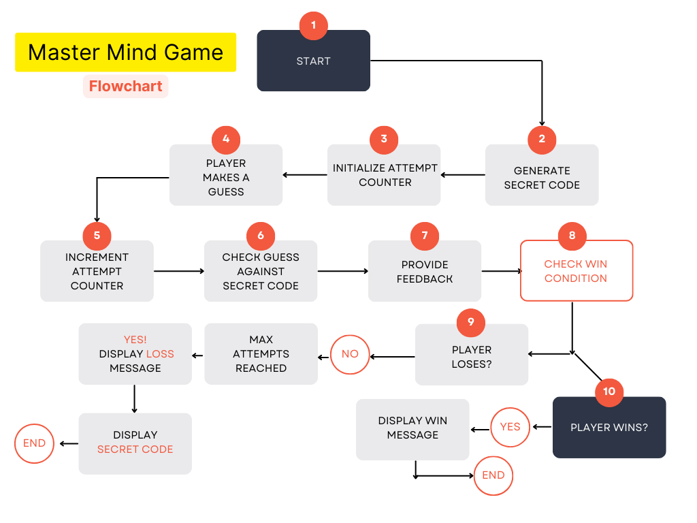

# [Master Mind GAME](https://mastermind-game-382624b289f8.herokuapp.com/)

**Master Mind** is a Python-based number guessing game that challenges players to guess a secret five-digit code within seven attempts. This game showcases Python's flexibility and strength. After each guess, players receive feedback to help guide them toward the correct answer. Can you uncover the secret code and become the ultimate Master Mind? This project is part of the third portfolio assignment for the Code Institute course.

- GitHub Profile: <https://github.com/klsoundarya/mastermind-game>
- Deployed Site: <https://mastermind-game-382624b289f8.herokuapp.com/>

## Game Flowchart

 

### User Stories
<!-- Read few README documents of previous batches to understand user stories and wrote accordingly -->

User Goals

 

#### First time User Goals

- As a user, I want to easily understand the rules and objective of the Mastermind game.
- As a user, I want to seamlessly register my name before starting the game.
- As a user, I want to select the difficulty level to match my skill and preference.
- As a user, I want to see the game title and instructions presented clearly in an engaging manner.
- As a user, I want to experience smooth and interactive gameplay with helpful feedback for each guess.
- As a user, I want to receive clear notifications on my progress, including how many digits I guessed correctly and in the correct position.
- As a user, I want the game to handle invalid inputs gracefully, providing me with clear instructions on what to do next.
- As a user, I want the option to quit the game at any point if I decide to stop playing.
- As a user, I want the game to congratulate me when I win and provide encouragement if I lose, enhancing my overall experience.
- As a user, I want the game to offer me an easy way to start a new game or restart after finishing one.
- As a user, I want the game to provide a consistent experience across different devices and screen sizes.
- As a user, I want the game interface to be intuitive and easy to navigate, ensuring a hassle-free gameplay experience.

#### Returning Site Users

- As a returning user, I want to skip the detailed rules and jump straight into gameplay.
- As a returning user, I want to remember my previous settings or allow me to quickly re-enter them.
- As a returning user, I want to challenge myself with different difficulty levels to keep the game interesting.
- As a returning user, I want to see improvements or new features added to the game since my last playthrough.
- As a returning user, I want to easily share my game achievements with friends or on social media.
- As a returning user, I want to compete against my previous scores or track my progress over time.
- As a returning user, I want to have a quick and seamless start to a new game without unnecessary delays.
- As a returning user, I want to experience smooth performance and bug-free gameplay regardless of any updates.

#### Site Owner Goals

- As a site owner, I want to create an engaging and enjoyable experience for users by providing a well-designed and interactive Mastermind game that captures their interest and keeps them returning to play.
- As a site owner, I want to ensure that the game accurately provides feedback on players' guesses, indicating correct digits and their positions, to offer a fair and transparent gaming experience.
- As a site owner, I want the game to perform smoothly across various devices and screen sizes, ensuring that all users can enjoy the game without technical issues or delays.
- As a site owner, I want the game's interface to be intuitive and easy to navigate, allowing players to understand and play the game without confusion.
- As a site owner, I want to keep the game updated with new features, improvements, and bug fixes to maintain user interest and ensure the game remains functional and enjoyable.
- As a site owner, I want to provide clear and concise instructions and rules for the game, ensuring that all players understand how to play and what to expect.
- As a site owner, I want to offer different difficulty levels so that players of all skill levels can enjoy the game and find it challenging and rewarding.
- As a site owner, I want to implement features that enhance player interaction, such as leaderboards or social sharing options, to foster a sense of community and competition.
- As a site owner, I want to ensure the game has high replayability by randomizing the secret numbers each game and potentially adding new game modes to keep players engaged.
- As a site owner, I want to gather user feedback on the game's functionality and enjoyment, using this input to make informed improvements and maintain high player satisfaction.
- As a site owner, I want to highlight the educational value of the game, such as improving logical thinking and problem-solving skills, to attract users interested in educational gaming.

### Target Audience

The Mastermind game is designed for puzzle enthusiasts and individuals who enjoy strategic, logic-based challenges. It appeals to those who like to test their deductive reasoning and problem-solving skills in a fun, competitive environment. The game is suitable for a wide age range, from older children to adults, making it an excellent choice for family game nights or intellectual entertainment. Its blend of simplicity in concept and complexity in execution makes it engaging for both casual players and serious gamers looking for a stimulating mental exercise. The game's interactive nature and progressively challenging gameplay provide a satisfying experience for those seeking an enjoyable and rewarding pastime.

## Deployment

### Heroku Deployment

The project is deployed in heroku using the following steps...

 

1. Create an account or log in to Heroku.
2. Click "New" on the dashboard and select "Create New App".
3. Choose a unique app name.
4. Select your region (US or Europe).
5. Add payment method if required.
6. Click "Create App".
7. Go to the Settings tab.
8. Under Config Vars, click "Reveal Config Vars".
9. Add a new Config Var: key = PORT, value = 8000.
10. Under Buildpacks, click "Add Buildpacks".
11. Select "python" and then "nodejs". Ensure python is first.
12. Go to the Deploy tab.
13. Select GitHub as the deployment method and confirm.
14. Search and connect your repository.
15. Choose automatic or manual deploy.
16. Click "View" to see the live site.

### GitHub Pages

The project is deployed in github pages using the following steps...

 

1. Log in to GitHub and locate [mastermind-game repository](https://github.com/klsoundarya/mastermind-game)
2. At the top of the Repository, locate the "Settings" Button on the menu.
3. Scroll down to "GitHub Pages" Section in Settings page.
4. Under "Source", click the dropdown called "None" and select "Master Branch".
5. The page will automatically refresh.

If using Gitpod, you can click below to create your own workspace using this repository.

#### Forking

By forking the GitHub Repository, we make a copy of the original repository on our GitHub account to view and/or make changes without affecting the original owner's repository.

You can fork this repository by using the following steps:

1. Log in to GitHub and locate the [mastermind-game repository](https://github.com/klsoundarya/mastermind-game)
2. At the top of the Repository (not top of page) just above the "Settings" Button on the menu, locate the "Fork" Button.
3. Once clicked, you should now have a copy of the original repository in your own GitHub account!

### Making a Local Clone

1. Log in to GitHub and locate the [mastermind-game repository](https://github.com/klsoundarya/mastermind-game)
2. Find the Code button situated above the file list and give it a click.
3. Choose your preferred cloning method — whether it's HTTPS, SSH, or GitHub and hit the copy button to copy the URL to your clipboard.
4. Launch Git Bash or Terminal.
5. Navigate to the directory where you want the cloned directory to reside.
6. In your IDE Terminal, input the following command to clone the repository:

> git clone <https://github.com/klsoundarya/mastermind-game>

**Press Enter and your local clone will be created**.

The live link can be found here - [Mastermind Game](https://mastermind-game-382624b289f8.herokuapp.com/)

This project is deployed using the Code Institute's mock terminal for Heroku.

